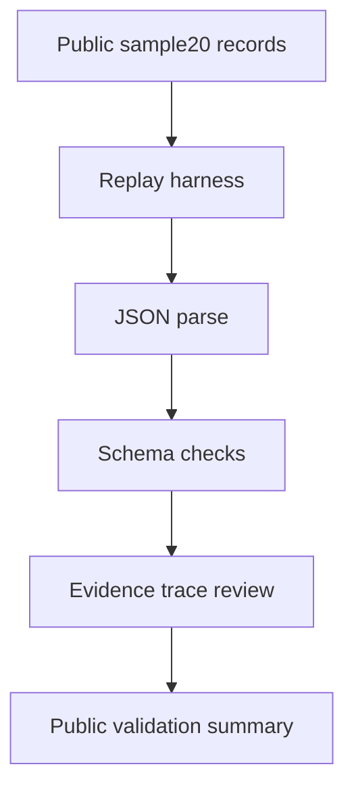

# Semantic BIM/IFC Evidence-Grounded Harness

[![Public sample20 validation][sample20-badge]][sample20-workflow]

This repository is an academic research artifact for public sample validation, traceable semantic BIM/IFC replay, and evidence-grounded AI benchmarking.

This is an academic research artifact. It is not a certification tool, production BIM service, or institutional endorsement. It contains only public synthetic or sanitized examples.

The badge validates only the public sanitized `sample20` replay and schema checks. It is not a certification or final A1 benchmark.

## What this project studies

This repository supports the broader research objective of explainable AI-assisted semantic BIM/IFC interpretation for Civil Engineering. Its technical focus is narrower and measurable: converting BIM/AECO requests and IFC-related runtime context into structured IFC-aware semantic records with validation, evidence traceability and reproducible replay.

This repository is not a generic BIM chatbot and does not claim to provide a complete BIM automation product.

It studies a narrower research task: **semantic BIM compilation**. The task is to convert natural-language AECO/BIM requests into structured IFC-aware semantic records that can be validated, replayed, compared and traced through evidence.

In practical terms, the project investigates a prompt-to-IFC contract:

```text
human BIM request
+ runtime BIM context
+ safety and evidence constraints
        ↓
structured IFC-aware semantic record
        ↓
schema validation
        ↓
IFC class / Pset / relationship checks
        ↓
evidence traceability
        ↓
reproducible replay and benchmark
```

The public repository provides a minimal reproducibility sample and documentation of the protocol. The larger curated synthetic/controlled dataset and systematic benchmark are the subject of the advanced computing access work.

The positioning can be read as follows:

```text
BIM 3D/IFC is the technical object.
Semantic compilation is the computational task.
Traceability and evidence are the XAI criterion.
The chat interface is the user-facing surface.
The benchmark is the evaluation method.
```

## Why not just IfcOpenShell + LLM + RAG?

IfcOpenShell, LLMs and retrieval-augmented generation are useful components, but they do not by themselves define an evaluable BIM semantic compilation task.

| Component | What it provides | What remains unresolved |
| --- | --- | --- |
| IfcOpenShell | IFC parsing, querying and manipulation | It does not interpret ambiguous professional BIM requests by itself. |
| LLM | Language understanding and generation | It may hallucinate IFC classes, Psets or relationships without contract-level validation. |
| RAG | Retrieval of relevant context fragments | Retrieval alone does not guarantee structured output, schema conformance or field-level evaluation. |
| This protocol | Structured IFC-aware semantic records, validation, evidence and replay | It turns the interaction into a measurable benchmark task. |

The contribution is therefore not another combination of existing tools. The contribution is the definition and evaluation of a structured semantic contract for BIM/IFC reasoning.

## What "semantic" means here

In this repository, "semantic" does not mean only embeddings or semantic search.

It means that a BIM request is decomposed into explicit, inspectable fields, including:

- intent class;
- semantic type;
- IFC class and IFC candidates;
- normalized dimensions;
- material information;
- required Psets;
- required IFC relationships;
- missing information;
- ambiguity flags;
- recovery needs;
- confidence;
- reason codes;
- evidence trace.

The semantic layer is therefore a structured contract between natural language and IFC-aware computation.

## What "XAI" means here

XAI is treated as evidence-oriented explainability, not as a claim of full mathematical interpretability.

The repository focuses on whether a semantic BIM output can expose:

- which IFC class or candidates were selected;
- which Psets and relationships are required;
- which fields are missing or ambiguous;
- which evidence fragments or runtime context supported the output;
- whether the generated record passes schema and replay validation.

This is closer to provenance, evidence traceability and structured auditability than to SHAP/LIME-style feature attribution.

## What This Repository Contains

- `sample20/`: the public sanitized sample dataset and its local manifest.
- `harness/`: a lightweight replay and validation harness.
- `benchmark/`: public sample validation results and benchmark notes.
- `PUBLIC_EVIDENCE.md`: public validation status and executable checks.
- `docs/public_boundary.md`: the public/private boundary map.
- `QUICKSTART.md`: minimal reproduction steps.

## Start Here

| Need | Path |
| --- | --- |
| public sample | `sample20/` |
| reproduce replay | `QUICKSTART.md` |
| validation evidence | `PUBLIC_EVIDENCE.md` |
| benchmark sample results | `benchmark/results_sample20.md` |
| public/private boundary | `docs/public_boundary.md` |

## Public Artifacts

| Artifact | Purpose |
| --- | --- |
| [sample20_public_records.jsonl](sample20/sample20_public_records.jsonl) | Sanitized public sample records |
| [schema_minimal.json](sample20/schema_minimal.json) | Minimal public contract for replay checks |
| [replay.py](harness/replay.py) | Public replay entrypoint |
| [schema_validator.py](harness/schema_validator.py) | Basic JSONL schema inspection helper |
| [smoke20_metrics_table.md](benchmark/metrics/smoke20_metrics_table.md) | Smoke run metrics table |
| [smoke20_research_summary.json](benchmark/metrics/smoke20_research_summary.json) | JSON summary of the smoke run |
| [semantic_bim_output_schema.json](benchmark/schema/semantic_bim_output_schema.json) | Semantic target schema definition |
| [public_forbidden_scan.py](scripts/public_forbidden_scan.py) | Public forbidden scan checker script |
| [schema_contract_map.md](docs/methodology/schema_contract_map.md) | Schema contract layers map |
| [results_sample20.md](benchmark/results_sample20.md) | Executed public sample validation results |
| [internal_preliminary_semantic_bim_runs.md](docs/experiments/internal_preliminary_semantic_bim_runs.md) | Internal preliminary experiments and feasibility evidence |
| [validation_gates.md](docs/methodology/validation_gates.md) | Methodology for the public validation gates |

## sample20

`sample20` is the public sanitized sample dataset.

`smoke20` is the public smoke/replay validation run executed against `sample20`; it is not a separate dataset.

`sample20` is a minimal public reproducibility sample. It is not presented as a complete corpus and is not intended to represent the full experimental dataset.

Its purpose is to show the structure of the records, the replay mechanism and the validation protocol. The larger curated synthetic/controlled dataset is part of the proposed advanced computing work.

The public sample is intentionally small so a reviewer can inspect the records, replay the harness, and understand the public/private boundary quickly.

## Quickstart

See [QUICKSTART.md](QUICKSTART.md) for the minimal local replay steps.

## Validation Status

Current public validation status: `RESEARCH_PASS`.

The validation checks can be run locally using the following commands:
```powershell
python harness/replay.py --sample sample20/
python harness/schema_validator.py sample20/sample20_public_records.jsonl
python scripts/public_forbidden_scan.py
```

The public replay and evidence summary are documented in `PUBLIC_EVIDENCE.md` and `benchmark/results_sample20.md`.

Internal preliminary experiments are summarized in [`docs/experiments/internal_preliminary_semantic_bim_runs.md`](docs/experiments/internal_preliminary_semantic_bim_runs.md). These runs are feasibility evidence only and are not final A1 benchmark results.

## What Is Not Claimed

- This repository does not claim full mathematical XAI.
- This repository does not claim SHAP, LIME, or equivalent attribution methods are implemented in the public sample.
- This repository does not claim certification, production readiness, or institutional endorsement.
- This repository does not include private datasets, adapters, checkpoints, or secrets.

## Links to Hugging Face

- Public replay space: https://huggingface.co/spaces/bimaiblend/semantic-xaibim-replay
- Public harness space: https://huggingface.co/spaces/bimaiblend/semantic-xaibim-harness

## Methodology Docs

- [validation_gates.md](docs/methodology/validation_gates.md)
- [xai_evaluation_position.md](docs/methodology/xai_evaluation_position.md)
- [dataset_construction_and_training_readiness.md](docs/methodology/dataset_construction_and_training_readiness.md)
- [semantic_bim_compilation_task.md](docs/methodology/semantic_bim_compilation_task.md)
- [xai_evidence_positioning.md](docs/methodology/xai_evidence_positioning.md)
- [dataset_scope_a1_advanced_computing.md](docs/methodology/dataset_scope_a1_advanced_computing.md)
- [schema_contract_map.md](docs/methodology/schema_contract_map.md)
- [public_boundary.md](docs/public_boundary.md)

## Evidence Trace Diagram



[sample20-badge]: https://github.com/BIMAIBlendgineer/semantic-bim-ifc-xai/actions/workflows/public-sample20.yml/badge.svg
[sample20-workflow]: https://github.com/BIMAIBlendgineer/semantic-bim-ifc-xai/actions/workflows/public-sample20.yml
