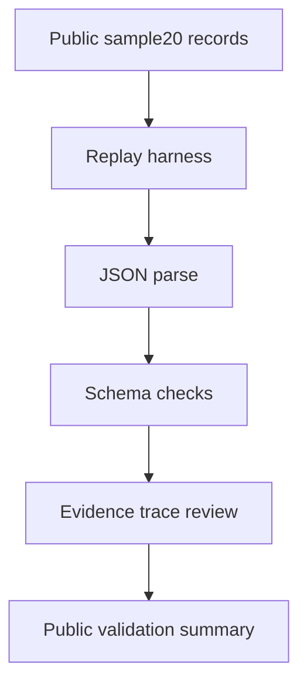

# Semantic BIM/IFC Evidence-Grounded Harness

[![Public sample20 validation][sample20-badge]][sample20-workflow]

This repository is an academic research artifact for public sample validation,
traceable semantic BIM/IFC replay, and evidence-grounded AI benchmarking.

This is an academic research artifact.
It is not a certification tool, production BIM service, or institutional endorsement.
It contains only public synthetic or sanitized examples.

The badge validates only the public sanitized sample20 replay and schema checks.
It is not a certification or final A1 benchmark.

## What This Repository Contains

- `sample20/`: the public sanitized sample dataset and its local manifest.
- `harness/`: a lightweight replay and validation harness.
- `benchmark/`: public sample validation results and benchmark notes.
- `PUBLIC_EVIDENCE.md`: public validation status and executable checks.
- `docs/public_boundary.md`: the public/private boundary map.
- `QUICKSTART.md`: minimal reproduction steps.

## Start Here

| Need | Path |
| --- | --- |
| public sample | `sample20/` |
| reproduce replay | `QUICKSTART.md` |
| validation evidence | `PUBLIC_EVIDENCE.md` |
| benchmark sample results | `benchmark/results_sample20.md` |
| public/private boundary | `docs/public_boundary.md` |

## Public Artifacts

| Artifact | Purpose |
| --- | --- |
| `sample20/sample20_public_records.jsonl` | Sanitized public sample records |
| `sample20/schema_minimal.json` | Minimal public contract for replay checks |
| `harness/replay.py` | Public replay entrypoint |
| `harness/schema_validator.py` | Basic JSONL schema inspection helper |
| `benchmark/results_sample20.md` | Executed public sample validation results |
| `docs/methodology/validation_gates.md` | Methodology for the public validation gates |

## sample20

`sample20` is the public sanitized sample dataset. `smoke20` is the public smoke/replay validation run executed against `sample20`; it is not a separate dataset.

The public sample is intentionally small so a reviewer can inspect the records, replay the harness, and understand the public/private boundary quickly.

## Quickstart

See [QUICKSTART.md](QUICKSTART.md) for the minimal local replay steps.

## Validation Status

Current public validation status: `RESEARCH_PASS`

The public replay and evidence summary are documented in `PUBLIC_EVIDENCE.md` and `benchmark/results_sample20.md`.

## What Is Not Claimed

- This repository does not claim full mathematical XAI.
- This repository does not claim SHAP, LIME, or equivalent attribution methods are implemented in the public sample.
- This repository does not claim certification, production readiness, or institutional endorsement.
- This repository does not include private datasets, adapters, checkpoints, or secrets.

## Links to Hugging Face

- Public replay space: <https://huggingface.co/spaces/bimaiblend/semantic-xaibim-replay>
- Public harness space: <https://huggingface.co/spaces/bimaiblend/semantic-xaibim-harness>

## Methodology Docs

- `docs/methodology/validation_gates.md`
- `docs/methodology/xai_evaluation_position.md`
- `docs/methodology/dataset_construction_and_training_readiness.md`
- `docs/public_boundary.md`

## Evidence Trace Diagram

[sample20-badge]: https://github.com/BIMAIBlendgineer/semantic-bim-ifc-xai/actions/workflows/public-sample20.yml/badge.svg
[sample20-workflow]: https://github.com/BIMAIBlendgineer/semantic-bim-ifc-xai/actions/workflows/public-sample20.yml
