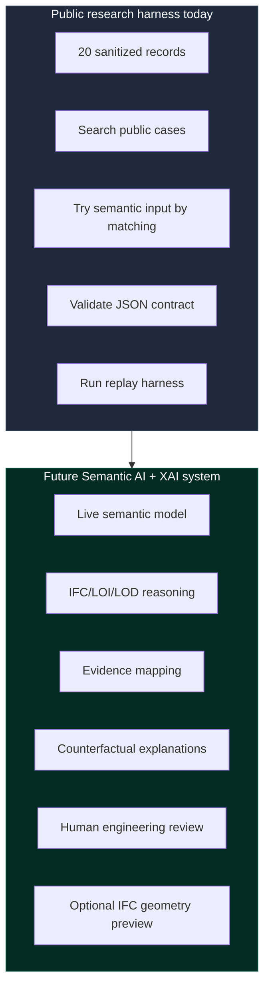
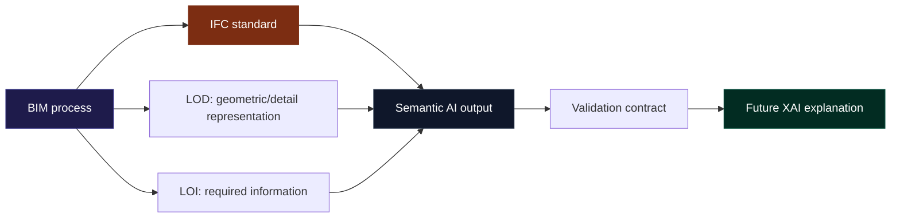

# Semantic AI for BIM/IFC: Public Research Harness

A public research artifact for studying how natural-language engineering requests can be mapped into structured BIM/IFC semantic outputs, validated records, evidence traces and future explainable AI workflows.

> [!IMPORTANT]
> **Ecosystem Disclaimer**: This repository is a public research artifact. It is intentionally separated from commercial XAIBIM ecosystem components. It is not an official product, certification system, university service or institutional endorsement.

---

## For Civil Engineers

Un ingeniero civil normalmente piensa en elementos físicos: pilares, vigas, muros, ventanas, losas, materiales, cargas, fases, interferencias y documentación. Un sistema BIM representa parte de esa realidad mediante geometría e información. La IA semántica aquí estudiada no intenta “dibujar bonito”; intenta comprender qué significa una petición técnica y transformarla en una estructura verificable.

### Ejemplo de interpretación semántica:

* **Input humano**: 
  * *“I need a reinforced concrete column with IFC classification and LOI information.”*
* **Interpretación semántica**:
  * **Elemento probable**: Columna estructural.
  * **Clase IFC candidata**: `IfcColumn`.
  * **Material candidato**: Reinforced concrete (hormigón armado).
  * **LOI (Level of Information)**: Información alfanumérica requerida para el componente.
  * **LOD (Level of Development)**: Representación geométrica (no generada todavía en la demo pública).
  * **Salida**: JSON estructurado que actúa como contrato técnico.
  * **Validación**: Comprobación automatizada de campos mínimos requeridos en el esquema.
  * **Explicación**: Evidencias y trazas textuales de por qué se realizó la interpretación anterior.

---

## Domain Concepts Explained

### What problem of civil engineering does this research address?
During design coordination and handover, critical engineering decisions are communicated in natural language (design briefs, review notes, regulatory codes). Converting these requests into parameters inside a BIM database is a manual, error-prone process. This research tests how AI can parse these prompts and ground them in standardized schemas automatically while maintaining a clear audit trail.

### Why BIM is not just 3D geometry
Building Information Modeling (BIM) is a relational database. The 3D coordinates (geometry) are only one part of the model. The real power of BIM lies in its database values: structural properties, fire ratings, acoustic data, costing parameters, and maintenance schedules. 

### Why IFC is important
The Industry Foundation Classes (IFC) schema is the open, vendor-neutral standard (ISO 16739) for BIM data exchange. Without IFC, building models cannot be audited or shared across different engineering softwares without major information loss.

### What does "semantic" mean in BIM/IFC?
In this research, "semantic" refers to the classification and attributes of an element rather than its physical geometry. It means mapping plain language concepts (e.g., *"exterior structural support"*) to explicit IFC types (`IfcColumn` with `IsExternal = True` and `LoadBearing = True`).

### What does the public demo do today?
It allows reviewers to:
1. Search and browse 20 sanitised research cases.
2. Type custom prompts to find the closest matching semantic result.
3. Validate custom JSON objects against the core contract schema.
4. Run validation scripts to prove reproducibility.

### What it does not do yet
- **No 3D Geometry**: It does not draw or output 3D geometry files.
- **No Live Inference**: It does not host active large language models. The matching is resolved deterministically against the sanitised database.

---

## Conceptual Framework Mappings

### LOI vs. LOD Distinction
- **LOD (Level of Development / Detail)**: Focuses on the geometric representation of a component (from a simple bounding box to detailed reinforcement bars).
- **LOI (Level of Information)**: Focuses on the alphanumeric metadata (material classifications, manufacturer data, property sets, and performance characteristics).

### Domain Separation
Engineering design is composed of multiple layers:
1. **Geometry**: The physical shape (LOD).
2. **Information**: Alphanumeric parameters (LOI).
3. **Semantics**: Meaning and relationships (IFC).
4. **Validation**: Automated schema checks to avoid structural metadata errors.
5. **Explanation**: Explaining *why* the AI generated a specific output, laying the foundation for trust.

---

## Core Diagrams

### Diagram 1 — Flujo Semántico
Shows the progression from a natural-language engineering request to a future explainable AI output:

### Diagram 2 — Qué Existe Hoy vs. Futuro
Contrasts the public validation harness with a fully realized live production and explanation system:

### Diagram 3 — Relación de Conceptos
Maps the boundary connections between BIM, IFC standards, geometric details, information requirements, validation contracts, and explainability:

## CPCA A1 methodology note

This repository includes a CPCA A1 methodological note describing how the public semantic BIM/IFC sample, validation harness, benchmark plan, LoRA/QLoRA adaptation strategy, quantization/QAT discussion and XAI methodology connect as a scientific workflow.

Read it here: [docs/cpca_a1_methodology_note.md](file:///C:/0%20Work/0%20XAIBIM/semantic/docs/cpca_a1_methodology_note.md)

---

## Technical Details

### Why JSON is used as a contract technical format
- **Machine readability**: Enables seamless API integration with CAD and BIM systems.
- **Reproducible validation**: Assures outputs match standard schemas before database mutation.
- **Audit and Replay**: Saves snapshots of model state and AI predictions for project history.

### What can be tested today in Hugging Face
Reviewers can access the spaces to verify:
- Semantic matching logic.
- JSON contract structures.
- Local regression and reproducibility runs.

- **Interactive Harness Space**: [semantic-xaibim-harness](https://huggingface.co/spaces/bimaiblend/semantic-xaibim-harness)
- **Replay Space**: [semantic-xaibim-replay](https://huggingface.co/spaces/bimaiblend/semantic-xaibim-replay)

---

## Future Research Scope
Future iterations of this research will include:
1. Live model APIs running fine-tuned civil domain LLMs.
2. Full mathematical XAI (SHAP/LIME) attribution.
3. Automated 3D IFC element generation and insertion.

---

The long-term goal is not to replace engineers, but to study how AI systems can make BIM/IFC interpretation more explicit, auditable and explainable.
